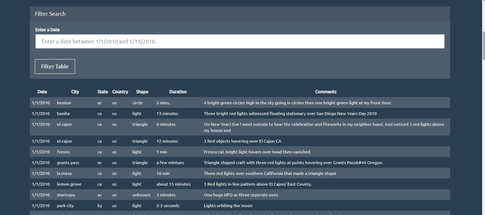
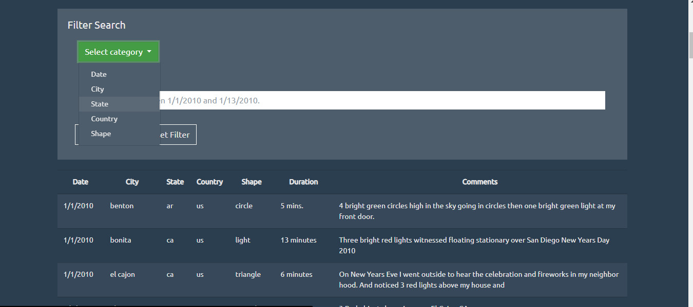
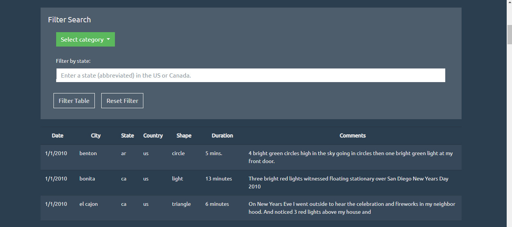

# JavaScript Challenge
Due 8/27/2020.

## Level 1: Search by Date
To view the Level 1 portion of the assignment, please navigate to the `UFO-level-1` directory and open `index.html`.

_Figure 1: Screenshot of the top of the Level 1 assignment page._

I used the provided HTML and CSS templates, with a few notable changes:
* I decided to use more specific placeholder instructions for searching for a date in the aside, since the dates of the provided data were limited to two weeks in January 2010.
* Because the instructions in the previous step were longer, I made the aside span the full width of the webpage on top of the table, rather than having it in a small box to the left.
* I re-styled the filter button and made the table responsive to hovers to make them a bit more visually appealing (to myself, at least).

_Figure 2: Screenshot of the filter-by-date elements for the Level 1 assignment, with the results table displayed below the input area._

## Level 2: Search by Multiple Categories
To view the Level 2 portion of the assignment, please navigate to the `UFO-level-2` directory and open `index.html`.

_Figure 3: Screenshot of the top of the Level 2 assignment page._

Here, I continued to build off of the previous page. The following are the further additions made:
* I changed the Bootswatch theme to a more updated version, since the provided theme gave me some issues with the dropdown menu I wanted to incorporate.
* I added a "reset filter" button to repopulate the full data upon clicking.
* I also added a dropdown menu with a list of each searchable category. Upon clicking each item, the placeholder text will change to fitting instructions. The input box will also be cleared.
* The table can now also be filtered by each of the categories in the dropdown menu.
* Various minor styling changes were made as well.

_Figure 4: Screenshot of the updated filter table with an open dropdown menu for the Level 2 assignment._

_Figure 5: Screenshot of the filter table after selecting "State" in the dropdown menu for the Level 2 assignment._

Please visit the respective folders for `UFO-level-1` and `UFO-level-2` for more screenshots if desired.
